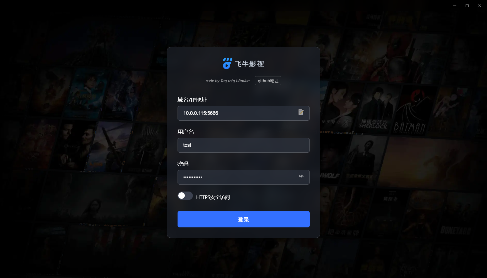
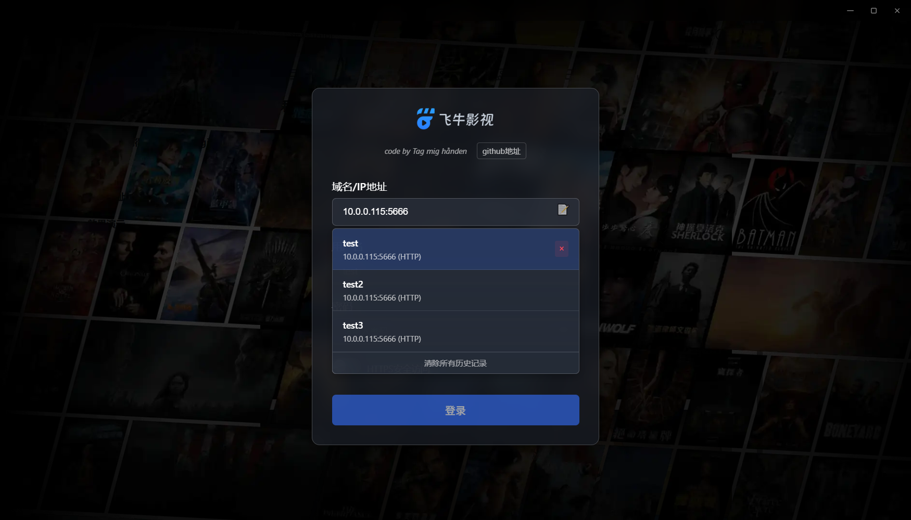
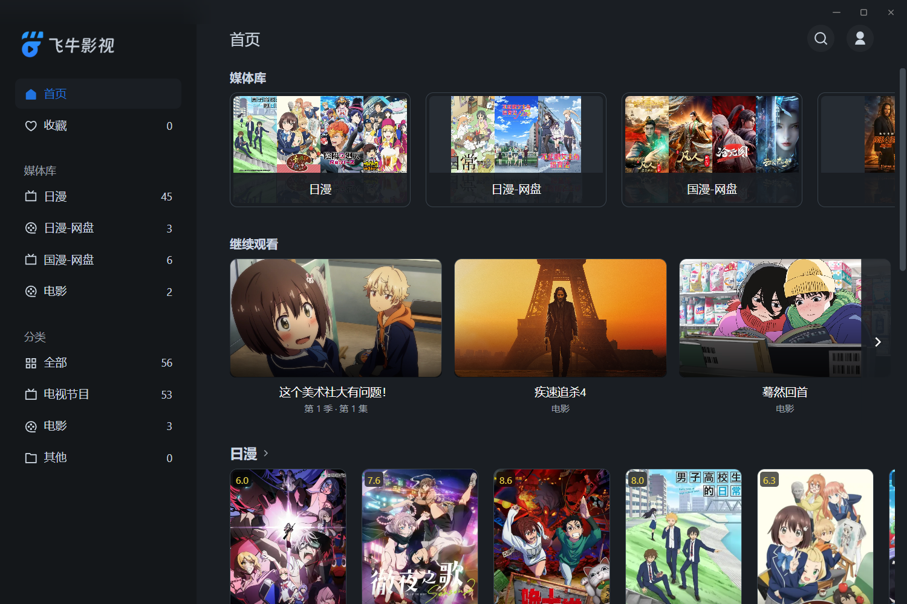
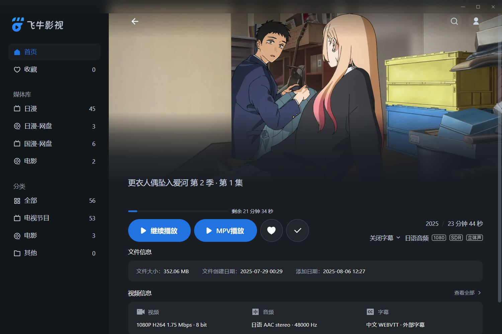

# fntv-electron 桌面客户端


飞牛影视桌面客户端，基于Electron构建，提供更好的桌面体验和增强功能。







[演示视频](https://www.bilibili.com/video/BV12dYXzhE6U/)

## ✨ 主要功能

- **原生桌面体验** - 基于飞牛影视Web端构建的桌面应用，提供类原生体验
- **自动登录** - 支持自动登录，支持多账户管理，自由切换账户和服务器
- **硬解播放** - 支持H264 / HEVC / VP9 / AV1，具体支持查看下面感谢项目
- **直链播放** - 支持调用内置MPV播放器直链播放视频(支持网盘挂载)，支持播放进度回传
- **弹幕支持** - MPV播放器支持弹幕自动匹配加载，无法匹配时支持手动搜索

## 更新记录

* 2025.8.23 - v1.6.3 优化mpv启动参数，固定启动时的初始窗口大小
* 2025.8.22 - v1.6.2 修改部分快捷键为potplayer常用键位，mpv播放器改为无边框
* 2025.8.21 - v1.6.1 修复缓存目录过大，超过100m自动清理
* 2025.8.21 - v1.6.0 支持登录界面填写服务器地址，支持多用户管理，关闭支持托盘
* 2025.8.20 - v1.5.0 所有可播放页面添加mpv播放按钮，mpv播放结束自动刷新页面，可继续点击观看下一集
* 2025.8.19 - v1.4.0 MPV播放器支持弹幕自动加载，无法识别时可手动搜索
* 2025.8.19 - v1.3.0 支持MPV播放器播放进度回传，优化mpv播放器配置
* 2025.8.18 - v1.2.0 MPV播放器支持自动读取外挂字幕
* 2025.8.17 - v1.1.0 支持视频直链解析，拒绝转码，使用内置mpv播放器播放(只支持剧集页和电影播放页)，暂不支持上报播放进度
* 2025.8.16 - v1.0.0 浏览器解码集成H264 / HEVC / VP9 / AV1
* 2025.8.15 - v1.0.0 飞牛客户端初版支持, 支持持久化登录信息

## 常用问题Q&A

### 1. 直接播放无法客户端硬解，还是在服务端解码？

只有mpv播放能保证直链硬解，其余的虽然浏览器支持了硬解，但是飞牛网页端识别有问题，还是会走服务端转码，需要飞牛修复。

### 2. mpv播放器功能有点少，怎么客制化，想添加补帧滤镜等？

打开你安装目录的third_party，只修改third_party\mpv\portable_config下面的插件，其余的不要动。其中input.conf是快捷键。

注意重新安装或者更新，会清空安装目录，注意备份你的mpv插件目录。

### 3. 是否支持网盘挂载播放？

支持，飞牛官方挂载的不支持302，需要官方支持。alist没有测试过，可以试一试。

### 4. 能否支持potplayer？

目前我这边没有使用potplayer的需求，如果需要的话可以自行修改源码适配一下。

### 5. 是否支持飞牛connect登录？

官方未开放相关API，无法支持。

### 6. 域名账号密码正确但是无法登录？

只支持正常dns解析的域名，和IP，其余的不支持。

### 7. 弹幕相关问题？

弹幕问题查看uosc_danmaku的文档，根据文档内容调整配置。

### 8. 能否支持linux或者macos？

我这边没有linux和mac设备，代码也没有做兼容处理，有需要的可以自行修改下。

### 9. 遇到dandanplay.exe报毒？

go的二进制压缩会被误报。可以查看这个issue，二进制由dandanplay提供 https://github.com/Tony15246/uosc_danmaku/issues/267

### 10.登录完客户端后，如果服务器连接不上登录会超时卡透明屏，无法切换或修改服务器配置，卸载重装也不行

去C:\\Users\\{你的计算机用户名}\\.fntv 下面把config.json删除了，因为连接成功后实际上加载的还是飞牛网页端，没响应当然会透明了。

## ⌨️ MPV播放器快捷键

```text
部分快捷键兼容potpolyer
查看安装目录下
third_party\mpv\portable_config\input.conf
```

## 🙏 特别感谢

本项目参考以下开源项目：

- [enable-chromium-hevc-hardware-decoding](https://github.com/StaZhu/enable-chromium-hevc-hardware-decoding) - Chromium HEVC硬解码支持
- [electron-media-patch](https://github.com/5rahim/electron-media-patch) - Electron硬解码补丁
- [fnToPotplayer](https://github.com/gudqs7/fnToPotplayer) - 飞牛影视调用Potplayer
- [fnos-tv](https://github.com/thshu/fnos-tv) - fnos-tv 支持弹幕的飞牛影视
- [mpv弹幕插件](https://github.com/Tony15246/uosc_danmaku) - uosc_danmaku 基于uosc的弹幕插件

## 📦 安装方法

### 预编译版本

前往 [Releases页面](https://github.com/QiaoKes/fntv-electron/releases) 下载最新版本：

* Windows: `FNMedia_${version}_${os}_${arch}.exe`

1.字段含义：

- version：版本号
- os：操作系统
- arch：系统架构

2.直接安装即可使用

### 从源码构建

1. 克隆仓库：

```bash
git clone https://github.com/QiaoKes/fntv-electron.git
cd fntv-electron
# 下载https://github.com/QiaoKes/fntv-electron/releases中的third_party.zip
#解压到third_party中
```

2. 安装依赖：

```bash
npm i
```

3. 运行开发模式：

```bash
npm start
```

4. 构建安装包：

```bash
# Windows
# 进入到C:\Users\{your_user_name}\AppData\Local\electron\Cache
# 创建文件夹b3ef7c180a968a1775be99205920d296f99e12cd36db5a1b9a5a2a3bb292f8ae
# 将third_party下的electron-v36.2.1-patch-win32-x64.zip拷贝到文件夹内
npm run build
```

## 🛠️ 开发指南

### 项目结构

```
fntv-electron/
├── third_party/          # 三方依赖
├── resource/             # 示例图片
├── release/              # 编译包目录
├── build/                # 构建资源
├── src/                  # 源码
├── config.json           # 调试用服务器地址配置
└── package.json
```

## 📄 许可证

本项目采用 [GPL3.0 许可证](LICENSE)

---

**温馨提示**：本项目为第三方客户端，与飞牛影视官方无关。使用前请确保遵守相关服务条款。
